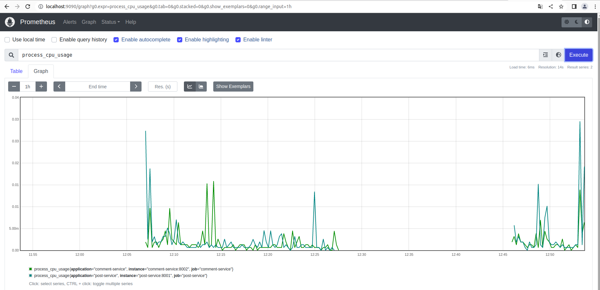
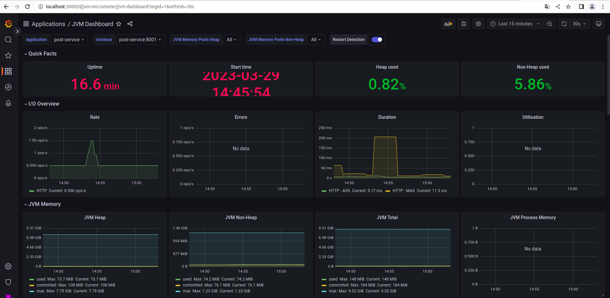

### Spinning up the containers

In the root folder of our project, where the `docker-compose-prometheus.yml` resides, spin up the Docker containers running `docker-compose -f docker-compose-prometheus.yml up -d`.

- **Prometheus**

  `Prometheus` can be accessed at http://localhost:9090

  

- **Grafana**

  `Grafana` can be accessed at http://localhost:3000

  > **Note**: in order to see post-service and comment-service metrics in Grafana, you must run the prometheus/grafana as Docker container

  _Configuration_

    - Access `Grafana` website
    - In order to login, type `user` and `password` for text field `username` and `password` respectively
    - You can skip the next screen that ask you to provide a new password
    - Click `General / Home` on the top
    - Click `JVM Dashboard`

  

- To stop the containers, use `docker-compose -f docker-compose-prometheus.yml down`.